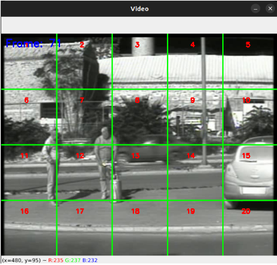
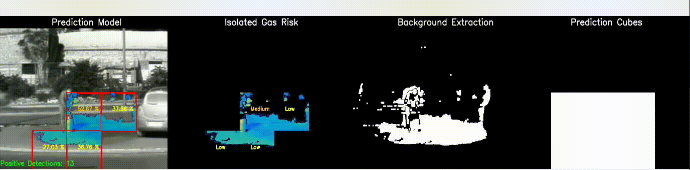

# Automatic Detection of Flammable Gases

## Introduction

This repository contains scripts developed within the framework of the master thesis titled "Automatic Detection of Flammable Gases (C3H8, CH4) in Thermal Infrared Data Video." The primary objective of this research was to build a gas detection system using computer vision and machine learning techniques applied to thermal image data. The infrared and thermal data can be analyzed for various applications, including early leak detection at oil refineries or identifying high voltage transmission at substations.

**Author: Antonios Koutroumpas**
**Contact: antonkout@gmail.com**

## Research Focus

The research focuses on designing an automatic gas detection and visualization system:

1. **Background Extraction Approach:**
    The initial step in our analysis involves isolating the gas plume from a thermal video by selectively detecting motion and filtering out undesired movements.

    **Motion Detection - Weighted Average Method:**
    - Calculate the average of the first frame's gray-level values.
    - Apply a 5x5 Gaussian blur to the frames.
    - Update the running average with an adjustable alpha value.
    - Compute the absolute difference between the running average and the first frame.
    - Apply a threshold to filter out noise-related pixels.

    **Refinement - MOG2 Background Subtractor:**
    - Utilize MOG2 Background Subtractor (OpenCV) to filter out fast-moving objects.
    - Apply a threshold to reduce noise.
    - Perform morphological opening and dilation to enhance fast-moving object representation.
    - Subtract the MOG2 output from the weighted average result.

    The combined approach effectively isolates low-motion objects with slow movement, specifically pedestrians and the gas plume, providing a refined representation of the target motion in the thermal video.
    
    

2. **Dataset Creation:**
    Constructing data cubes to capture motion involves the following steps:

    **Frame Splitting:**
    - Split each video frame into 20 patches.
    - Each patch has dimensions of 128x128 pixels.
    **Sequencing:**
    - Capture 13 consecutive frames from the video sequence.
    **Data Cube Generation:**
    - Combine the 20 patches from each of the 13 frames to create data cubes.
    - Each data cube represents a spatiotemporal volume capturing the motion information.
    **Training Data:**
    - Save these generated data cubes for training purposes.

    

    This process enables the effective representation of motion patterns in a video sequence, facilitating training for various applications such as motion detection or analysis.

3. **Feature Extraction:**
    During testing, an exploration of diverse features was conducted to extract meaningful information from grayscale frames. This involved examining both static features on a per-frame basis and dynamic features within each data cube.

    **Static Descriptors:**
    - Local Binary Patterns (LBP)
    - GLCM Texture Features
    - Hessian Matrix and Eigenvalues
    **Dynamic Descriptors:**
    - Histogram of Gradients (HOG)
    - Histogram of Optical Flow (HOF)

    These descriptors contribute to a comprehensive representation of motion patterns in the thermal video, capturing both spatial and temporal features. For detailed scripts related to feature extraction, refer to the `feature_extraction` module in the project structure.

4. **Model Training:**
    During the model training, several classifiers where tested to check which one performs the best.
    
    ### Stochastic Gradient Descent (SGD) with Linear SVM:
    - Efficient optimization algorithm for training classifiers.
    - Iteratively adjusts the SVM's decision boundary, scalable to large datasets.
    - Well-suited for dynamic environments and high-dimensional feature spaces.
    ### Adaboost (Adaptive Boosting):
    - Ensemble learning algorithm creating a strong model from weak learners.
    - Utilizes classifiers, such as Stochastic Gradient Descent (SGD), iteratively.
    - Assigns weights to training instances based on classification performance.
    ### Random Forest:
    - Ensemble learning method constructing multiple decision trees.
    - Robust and accurate model that mitigates overfitting.
    - Widely used for classification and regression in diverse datasets.
    ### Naive Bayes:
    - Probabilistic algorithm based on Bayes' theorem.
    - Assumes feature independence, making it computationally efficient.
    - Effective for text classification and scenarios with limited data.

    ### Model Architecture:
    - Utilized three videos (Propane, Methane, Gas_mixture1) for training.
    - Extracted 6,681 data cubes, comprising gas_present and nongas_present instances.
    - Thoroughly analyzed each cube's features, including HOG, HOF, LBP, Hessian eigenvalues, and GLCM.
    ### Validation Phase:
    - Used the last video, Gas_mixture2, for validation.
    - Evaluated model performance on 83 gas_present and 847 nongas_present cubes.
    ### Feature Computation:
    - Computed essential features (HOG, HOF, LBP, Hessian eigenvalues, GLCM) for all datasets.
    - Features characterize spatial and temporal aspects, facilitating classifier training.

5. **Prediction:**

    For thermal video frame detection, the following approach was employed:

    - **Foreground Isolation:**
    - The gas plume, indicative of the foreground, was isolated from the background.
    - The percentage of foreground pixels in each patch was computed.
    - **Prediction Area:**
    - If more than 50% of pixels were positive, the entire patch was labeled as positive.
    - This labeled area served as the prediction zone.
    - **Integrated Approach:**
    - Integrates background extraction with classifier detection.
    - Focuses exclusively on patches flagged by background extraction for gas plume presence.
    - Accelerates the system, enabling near real-time detections.

### Results Overview:

## Project Structure

The project is organized into the following folders:

1. **analysis:** Contains scripts related to data analysis.
2. **classifier:** Includes scripts for training and evaluating classifiers.
3. **data:** Reserved for storing data relevant to the project.
4. **dataset:** Scripts for creating datasets are placed here.
5. **environment:** Manages environment configurations.
6. **figures:** Stores visualizations and figures generated during the research.
7. **module:** Core scripts for background extraction, dataset creation, feature extraction, model training, prediction, and video utilities.
8. **parameters:** Centralized location for storing configuration parameters.

## Module Scripts

1. **background_extraction.py:** Script for extracting background information.
2. **dataset_creation.py:** Script for creating datasets for model training.
3. **feature_extraction.py:** Extracts features from the dataset.
4. **model_training.py:** Trains machine learning models using the prepared dataset.
5. **prediction.py:** Script for making predictions using trained models.
6. **video_utils.py:** Utilities for processing and analyzing thermal video data.

Feel free to explore each folder for detailed information on scripts and functionalities.

## License

This project is licensed under the [MIT License](LICENSE).
